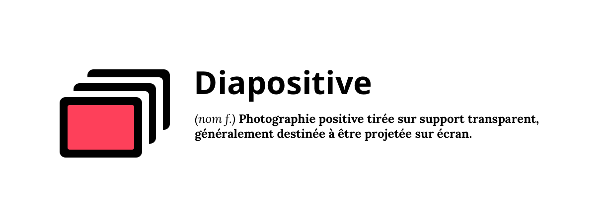

### Diapositive is a dependency-free Javascript slideshow building library. It does only one thing but does it well: adding a class to the current slide.

## Philosophy

The idea behind this library is to provide boilerplate code to quickly bootstrap interesting slideshow components.

It is only concerned with how things should work, not how they should look. By providing a tiny API surface, this library aims to simplify slideshow development to let you spend more time on styling or more valuable features.

## Example

You can find a simple usage example in the example folder. I encourage you to play with it to get a feel of what the library is doing.

## Getting started

Download latest version with NPM...

```bash
npm install diapositive
```

(you can also link to the lib in html head with unpkg: `<script src="https://unpkg.com/diapositive@latest/dist/diapositive.js"></script>`)

...then create some markup...

```html
<ul>
  <li>Julien</li>
  <li>André</li>
  <li>Marcel</li>
</ul>

<button id="prev">Previous</button>
<button id="next">Next</button>
```

...and finally initialize Diapositive.
```js
import Diapositive from 'diapositive';

const diapo = new Diapositive('ul');

document.getElementById('prev').onclick = diapo.prev;
document.getElementById('next').onclick = diapo.next;
```

You're all set! Now Diapositive will take care of adding an `active` class to the correct element.

```html
<ul>
  <li class="active">Julien</li>
  <li>André</li>
  <li>Marcel</li>
</ul>

...Next button clicked...

<ul>
  <li>Julien</li>
  <li class="active">André</li>
  <li>Marcel</li>
</ul>
```

## Styling

As intended, this library only provides minimal functionality. You are responsible for everything styling related.

The simplest example would be something like this:
```css
ul li {
  display: none;
}

ul li.active {
  display: block;
}
```

## API

Diapositive exposes these methods to navigate between slides:

#### Diapositive.next()
Go to previous slide. If current slide is first slide, go to last slide.

#### Diapositive.prev()
Go to next slide. If current slide is last slide, go to first slide.

#### Diapositive.goTo(index)
Go to slide at given 0 based index.

#### Diapositive.start()
Starts Diapositive autoplay. Time is configurable via Diapositive.time option.

#### Diapositive.stop()
Stops Diapositive autoplay.

## Options

Diapositive takes an optional `options` object. If none is specified, reasonable defaults are used.

```js
options = {
  autoPlay: false, // if the Diapositive instance should loop automatically
  className: 'active', // the className added to the active slide
  startAt: 0, // the first focused slide when a new Diapositive instance is created (0 indexed)
  time: 2000, // delay between slides if autoplay is set to true
}
```
